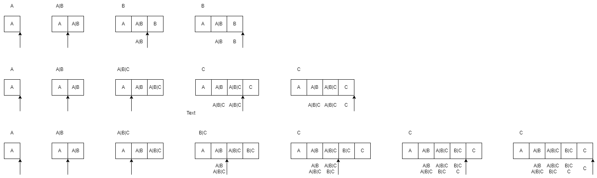

# joint/append time

## implementation

- 不阻塞
  - 不缩并
  - 缩并最新配置 + 不append
  - 缩并最新配置 + append
  - 缩并 + 不append
  - 缩并 + append
- 阻塞
  - 不缩并
  - 缩并 + 不append
  - 缩并 + append

## example: 不阻塞/缩并 + append

## proof

